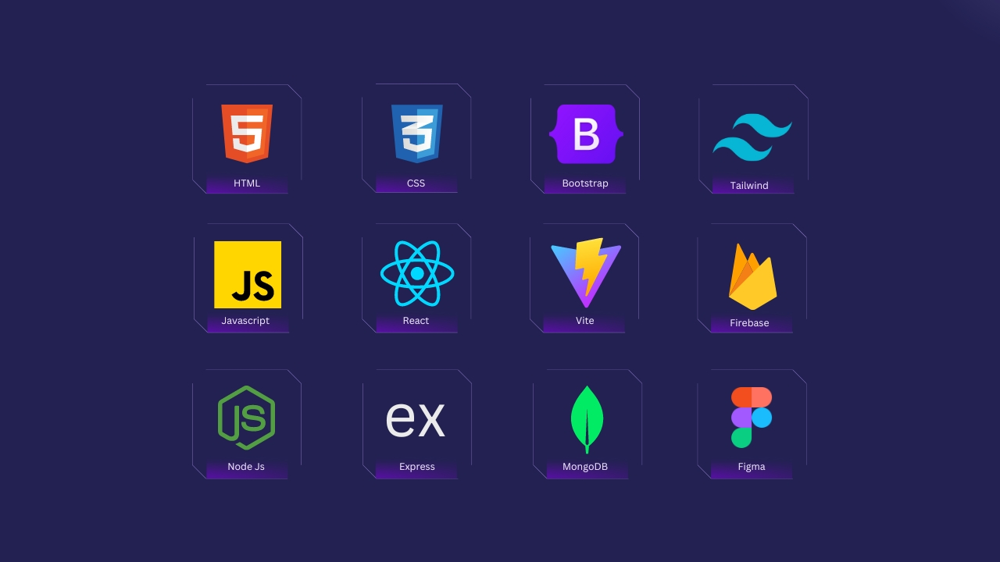

<h2 align="center"> Hi, I'm Abdur Rahman 👋</h2>

I am a Front End Web developer with a strong skill set in JavaScript, and I am particularly passionate about using the MERN Stack. My focus is on creating exceptional web experiences that prioritize the user, and I thrive on collaborating as a team player. To keep up with the latest front-end technologies and best practices, I am constantly improving my skills. 

 
 

<h2>Current Stats</h2>

  

 

.<h2>Connect with me!</h2>
 
<a href="https://www.linkedin.com/in/programmerabdurrahman/" target="_blank"><a/>
<a href="https://www.facebook.com/get.abdurahman" target="_blank"><a/>
<a href="#" target="_blank"><a/>
 

.<h2>Technologies that I know</h2>

                        
